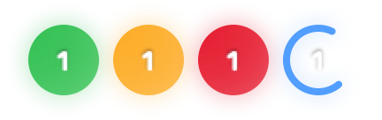
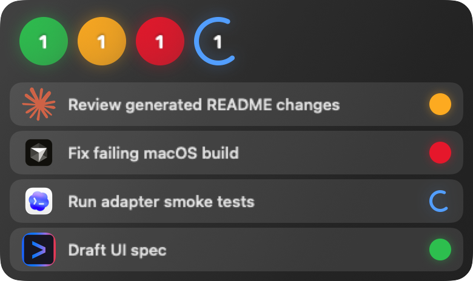

# Agent Beacon

Tiny status lights for your coding agents. ✨

Agent Beacon lives in your macOS menu bar and shows which agent task is done, waiting, failed, or still running.


## 🟢 Why It Exists

When Codex, Claude Code, Cursor, Gemini CLI, and local scripts are all working at once, it is easy to lose track of what needs attention.

Agent Beacon keeps that answer in one quiet menu bar panel:

```text
completed | needs review | failed | running
```

Hover the panel to see the task list. Click a row to jump back to the app.

| Menu bar | Hover |
| --- | --- |
|  |  |

## ⬇️ Download

Download `AgentBeacon-macOS.dmg` from [Releases](https://github.com/XiaoLuoLYG/agent-beacon/releases).

1. Open the DMG.
2. Drag `Agent Beacon.app` to `Applications`.
3. Open Agent Beacon.
4. Right-click the menu bar icon and choose `Connect Installed Agents`.
5. Restart your terminal.

This preview DMG is unsigned. If macOS blocks the first launch, right-click `Agent Beacon.app`, choose `Open`, then confirm once.

## ⚡ What It Tracks

- CLI-launched Codex, Claude Code, Cursor, Gemini CLI, and generic commands through local shims.
- Codex local session metadata.
- Cursor local composer header metadata.
- Explicit status updates from `~/.agent-beacon/status.json`.

Agent Beacon only shows states it can verify. It does not guess from private app UI.

## 🔒 Local By Default

Agent Beacon does not show conversation bodies, source files, terminal output, prompts, model responses, or logs.

It reads small local status records and metadata needed for task names, states, and jump targets.

## Build From Source

```bash
make test
make run
make package
```

More docs:

- [Install](docs/INSTALL.md)
- [Quickstart](docs/QUICKSTART.md)
- [Privacy](docs/PRIVACY.md)
- [Roadmap](docs/ROADMAP.md)

MIT License.
