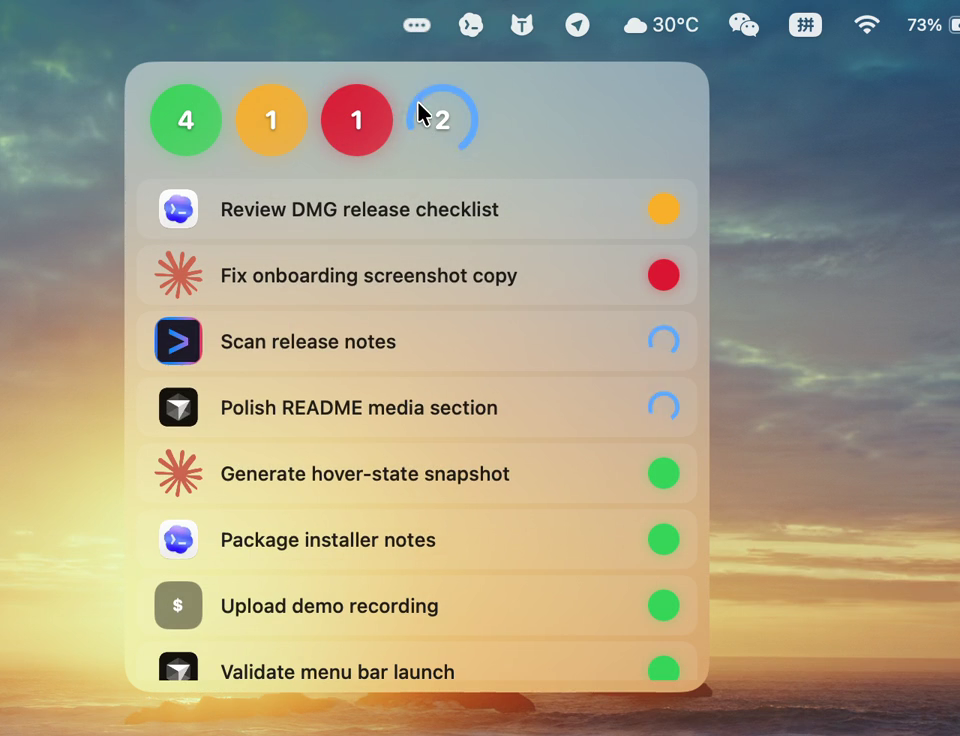

# Agent Beacon

Tiny status lights for your coding agents. ✨

Agent Beacon lives in your macOS menu bar, shows which agent task is done, waiting, failed, or still running, and lets you click a row to jump back to the app.


## 🟢 Why It Exists

When Codex, Claude Code, Cursor, Gemini CLI, and local scripts are all working at once, it is easy to lose track of what needs attention.

Agent Beacon keeps that answer in one quiet menu bar panel:

```text
completed | needs review | failed | running
```

Click the menu bar icon to open the lights. Hover the panel to expand the task list.

<p align="center">
  
</p>

## ⬇️ Install

The lowest-friction preview install is a one-line Terminal command:

```bash
curl -fsSL https://raw.githubusercontent.com/XiaoLuoLYG/agent-beacon/main/scripts/install-from-release.sh | bash
```

It downloads the latest release, installs `Agent Beacon.app` to `~/Applications`, installs the helper commands, connects supported agent CLIs, removes macOS quarantine from the installed app, and opens Agent Beacon.

The icon appears in the macOS menu bar. If you are in a full-screen app or your menu bar is hidden, move the pointer to the top edge of the screen or leave full screen first.

The DMG remains available on [Releases](https://github.com/XiaoLuoLYG/agent-beacon/releases), but unsigned DMG installs can trigger Gatekeeper's first-launch warning. Use the one-line installer for the preview build if you want the smoother path.

## ⚡ What It Tracks

- CLI-launched Codex, Claude Code, Cursor, Gemini CLI, and generic commands through local shims.
- Codex local session metadata.
- Cursor local composer header metadata.
- Explicit status updates from `~/.agent-beacon/status.json`.

More agent integrations are in progress.

Agent Beacon only shows states it can verify. It does not guess from private app UI.

## 🔒 Local By Default

Agent Beacon does not show conversation bodies, source files, terminal output, prompts, model responses, or logs.

It reads small local status records and metadata needed for task names, states, and jump targets.

## Build From Source

```bash
make test
make run
make package
```

More docs:

- [Install](docs/INSTALL.md)
- [Quickstart](docs/QUICKSTART.md)
- [Privacy](docs/PRIVACY.md)
- [Roadmap](docs/ROADMAP.md)

MIT License.
